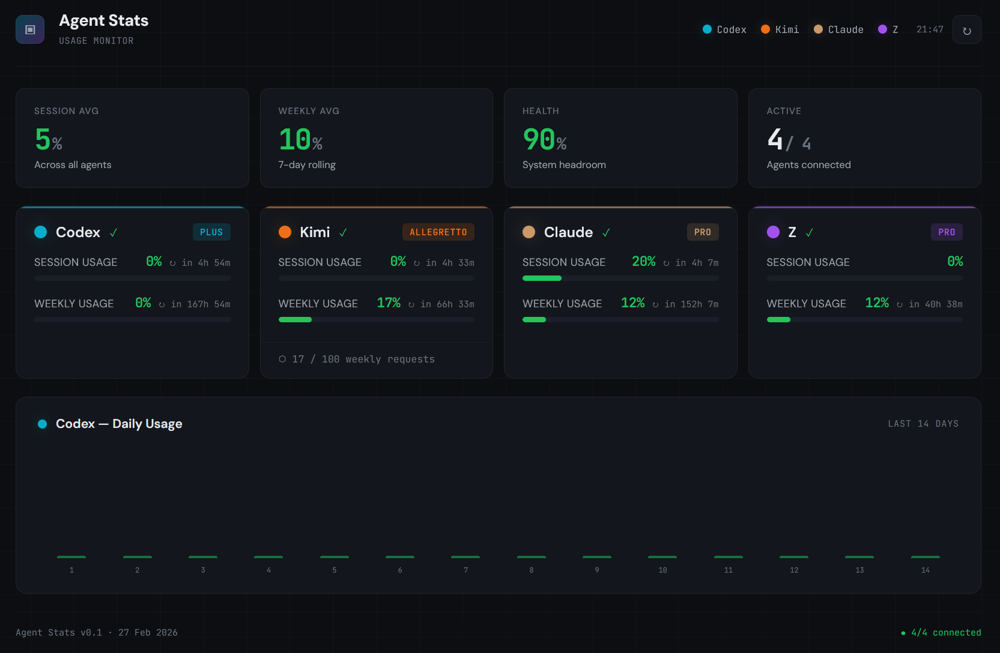

# Agent Stats

Self-hosted dashboard for monitoring usage limits across AI coding assistants: **OpenAI Codex**, **Kimi Code**, **Claude**, and **Z-AI**.

A Docker stack with two containers: a Firefox browser (noVNC) that keeps your sessions alive, and a Python backend that reads cookies from Firefox, queries each service's API, and serves a real-time dashboard.



## Features

- Unified view of session and weekly usage across 4 AI assistants
- Automatic cookie-based authentication (no manual token management)
- Real-time usage bars with color-coded thresholds (ok / warning / critical)
- Stale data detection — shows last known data when a service is unreachable
- Codex daily usage chart (last 14 days)
- Dark theme, zero JavaScript frameworks, single-file frontend
- Background polling with configurable refresh interval

## Architecture

```
┌──────────────────────────────────────────────────────────┐
│  Docker Host                                              │
│                                                           │
│  ┌─────────────┐    shared volume     ┌────────────────┐  │
│  │   Firefox    │   firefox_data      │   Dashboard     │  │
│  │  (noVNC)     │──────────────────→  │  (Python/Flask) │  │
│  │  :5800       │   cookies.sqlite    │  :8777          │  │
│  └─────────────┘                      └───────┬────────┘  │
│        ↑                                      │           │
│   user logs in                                ↓           │
│   to services                          External APIs      │
│                                     chatgpt.com, kimi.com │
│                                     claude.ai, z.ai       │
└──────────────────────────────────────────────────────────┘
```

See [docs/architecture.md](docs/architecture.md) for details.

## Quick Start

### Prerequisites

- Docker and Docker Compose
- (Optional) Z-AI API key — see [Configuration](#configuration)

### Setup

```bash
# Clone the repository
git clone https://github.com/konradozog-debug/AgentsUsageDashboard.git
cd AgentsUsageDashboard

# Copy and edit environment variables
cp .env.example .env
# Edit .env if you want Z-AI monitoring (add your API key)

# Build and start
docker compose up -d --build
```

### First Run

1. Open **http://localhost:5800** — this is the Firefox browser GUI (noVNC)
2. Log in to the services you want to monitor:
   - [chatgpt.com](https://chatgpt.com) (for Codex)
   - [kimi.com](https://kimi.com) (for Kimi Code)
   - [claude.ai](https://claude.ai) (for Claude)
3. Open **http://localhost:8777** — the dashboard will start showing data within 5 minutes

That's it. Firefox keeps the sessions alive, and the dashboard reads cookies automatically.

## Configuration

All configuration is via environment variables in `.env` (or `docker-compose.yml`):

| Variable | Default | Description |
|----------|---------|-------------|
| `ZAI_API_KEY` | _(empty)_ | Z-AI API key in `id.secret` format ([get one here](https://z.ai/manage-apikey/apikey-list)) |
| `REFRESH_INTERVAL` | `300` | Data refresh interval in seconds |
| `DEBUG` | `false` | Enable `/api/cookies` debug endpoint |
| `TZ` | `Europe/Warsaw` | Timezone for timestamps |

## API Endpoints

The dashboard exposes:

| Endpoint | Method | Description |
|----------|--------|-------------|
| `/` | GET | Dashboard UI |
| `/api/data` | GET | Current cached data (JSON) |
| `/api/refresh` | GET | Force immediate data refresh |
| `/api/cookies` | GET | Cookie diagnostics (requires `DEBUG=true`) |

For details on the external APIs used, see [docs/api-endpoints.md](docs/api-endpoints.md).

## Security Notes

This dashboard is designed for **private, self-hosted use** on a trusted network.

- **No authentication** — all endpoints are open. Place behind a reverse proxy with auth (e.g., Nginx + basic auth, Caddy, Authelia) or access via VPN/Tailscale if exposed beyond localhost.
- **Port 5800** (Firefox noVNC) gives full browser access to your logged-in sessions. Never expose it to the public internet.
- **Port 8777** shows your usage data. Restrict access as needed.

## Troubleshooting

- **No data showing?** Open `:5800`, check you're logged in to all services
- **Debug cookies:** Set `DEBUG=true` in `.env`, restart, check `http://localhost:8777/api/cookies`
- **Force refresh:** Visit `http://localhost:8777/api/refresh`
- **Z-AI not working?** Verify your API key format is `id.secret` (two parts separated by a dot)
- **Stale data?** Session expired — re-login via Firefox GUI (`:5800`)

## Documentation

- [API Endpoints](docs/api-endpoints.md) — full request/response specs for all monitored services
- [Architecture](docs/architecture.md) — data flow diagram and component overview
- [Cookie Flow](docs/cookie-flow.md) — how Firefox cookie reading works
- [Design System](docs/design-system.md) — UI design tokens and component specs

## Tech Stack

- **Backend:** Python 3.12, Flask, gunicorn (gthread), curl_cffi
- **Frontend:** Vanilla HTML/CSS/JS (single file, no build step)
- **Infrastructure:** Docker Compose, jlesage/firefox (noVNC)
- **Cookie reading:** SQLite (Firefox cookie/localStorage databases)

## Contributing

1. Fork the repository
2. Create a feature branch (`git checkout -b feature/amazing-feature`)
3. Commit your changes
4. Push to the branch (`git push origin feature/amazing-feature`)
5. Open a Pull Request

## License

This project is licensed under the MIT License — see [LICENSE](LICENSE) for details.
